# Diagrama de Entidade e Relacionamento (DER)

## Sistema de Controle de Vendas

Este documento descreve a modelagem conceitual e lógica do banco de dados relacional para o sistema web de **Controle de Vendas**, desenvolvido sob engine **InnoDB**, charset **UTF8MB4** e com padrão de nomenclatura estritamente em **Português** (snake_case).

---

## 1. Diagrama Entidade-Relacionamento (Mermaid)

```mermaid
erDiagram
    %% ----------------------------------------------------
    %% MÓDULO 1: SEGURANÇA E ACESSO
    %% ----------------------------------------------------
    perfis ||--o{ usuarios : "1:N (possui)"
    
    perfis {
        int id_perfil PK
        string nome UK
        string descricao
        tinyint ativo
        datetime data_cadastro
        datetime data_atualizacao
    }

    usuarios {
        int id_usuario PK
        int id_perfil FK
        string nome
        string email UK
        string senha
        string telefone
        string foto
        tinyint ativo
        datetime ultimo_acesso
        datetime data_cadastro
        datetime data_atualizacao
    }

    %% ----------------------------------------------------
    %% MÓDULO 2: PRODUTOS, CUSTOS E ESTOQUE
    %% ----------------------------------------------------
    categorias_produtos ||--o{ produtos : "1:N (agrupa)"
    produtos ||--|| estoque : "1:1 (saldo_atual)"
    produtos ||--o{ historico_custos : "1:N (historico_aquisicao)"
    produtos ||--o{ unidades_produto : "1:N (rastreamento_serial)"
    produtos ||--o{ movimentacoes_estoque : "1:N (extrato)"
    usuarios ||--o{ movimentacoes_estoque : "1:N (operador)"

    categorias_produtos {
        int id_categoria PK
        string nome UK
        string descricao
        tinyint ativo
        datetime data_cadastro
        datetime data_atualizacao
    }

    produtos {
        int id_produto PK
        int id_categoria FK
        string nome
        string sku UK
        string codigo_barras UK
        string descricao
        string unidade
        decimal preco_venda
        decimal margem_desejada
        decimal estoque_minimo
        tinyint controla_estoque
        tinyint controla_unidade
        tinyint ativo
        datetime data_cadastro
        datetime data_atualizacao
    }

    unidades_produto {
        int id_unidade_produto PK
        int id_produto FK
        string numero_serie
        string imei
        decimal custo_aquisicao
        enum estado_conservacao
        decimal percentual_bateria
        enum status
        datetime data_entrada
        datetime data_saida
        text observacao
        datetime data_cadastro
        datetime data_atualizacao
    }

    historico_custos {
        int id_historico_custo PK
        int id_produto FK
        decimal custo_unitario
        decimal quantidade
        date data_custo
        string observacao
        datetime data_cadastro
    }

    estoque {
        int id_estoque PK
        int id_produto FK, UK
        decimal quantidade_atual
        decimal custo_medio
        decimal valor_investido
        datetime data_atualizacao
    }

    movimentacoes_estoque {
        int id_movimentacao PK
        int id_produto FK
        int id_usuario FK
        enum tipo_movimentacao
        decimal quantidade
        decimal custo_unitario
        string documento_referencia
        text observacao
        datetime data_movimentacao
        datetime data_cadastro
    }

    %% ----------------------------------------------------
    %% MÓDULO 3: CLIENTES, CANAIS E FORMAS DE PAGAMENTO
    %% ----------------------------------------------------
    clientes ||--o{ vendas : "1:N (compra)"
    usuarios ||--o{ vendas : "1:N (vende)"
    plataformas ||--o{ vendas : "1:N (canal_venda)"
    plataformas ||--o{ taxas : "1:N (comissao_padrao)"

    clientes {
        int id_cliente PK
        string nome
        string cpf_cnpj
        string telefone
        string email
        string cep
        string logradouro
        string numero
        string complemento
        string bairro
        string cidade
        char estado
        text observacoes
        tinyint ativo
        datetime data_cadastro
        datetime data_atualizacao
    }

    plataformas {
        int id_plataforma PK
        string nome UK
        string descricao
        decimal percentual_comissao_padrao
        decimal taxa_fixa_padrao
        tinyint ativo
        datetime data_cadastro
        datetime data_atualizacao
    }

    formas_pagamento {
        int id_forma_pagamento PK
        string nome UK
        enum tipo
        tinyint ativo
        datetime data_cadastro
        datetime data_atualizacao
    }

    %% ----------------------------------------------------
    %% MÓDULO 4: VENDAS, ITENS, PAGAMENTOS E TAXAS
    %% ----------------------------------------------------
    vendas ||--|{ itens_venda : "1:N (composta_por)"
    produtos ||--o{ itens_venda : "1:N (item)"
    vendas ||--|{ pagamentos : "1:N (liquidada_em)"
    formas_pagamento ||--o{ pagamentos : "1:N (meio_utilizado)"
    pagamentos ||--o{ parcelas : "1:N (desdobramento)"
    vendas ||--o{ taxas : "1:N (incidencia)"
    pagamentos ||--o{ taxas : "1:N (tarifa_financeira)"

    vendas {
        int id_venda PK
        int id_cliente FK
        int id_usuario FK
        int id_plataforma FK
        datetime data_venda
        decimal subtotal
        decimal desconto
        decimal frete
        decimal valor_total
        decimal custo_total
        decimal taxas_total
        decimal lucro_bruto
        decimal lucro_liquido
        decimal margem_percentual
        enum tipo_venda
        enum status
        text observacoes
        datetime data_cadastro
        datetime data_atualizacao
    }

    itens_venda {
        int id_item_venda PK
        int id_venda FK
        int id_produto FK
        decimal quantidade
        decimal preco_unitario
        decimal desconto
        decimal custo_unitario
        decimal custo_total
        decimal valor_total
        decimal lucro_bruto
        datetime data_cadastro
    }

    pagamentos {
        int id_pagamento PK
        int id_venda FK
        int id_forma_pagamento FK
        decimal valor
        int quantidade_parcelas
        decimal percentual_taxa
        decimal valor_taxa
        datetime data_pagamento
        enum status
        string observacao
        datetime data_cadastro
        datetime data_atualizacao
    }

    parcelas {
        int id_parcela PK
        int id_pagamento FK
        int numero_parcela
        int quantidade_parcelas
        decimal valor
        date data_vencimento
        datetime data_recebimento
        decimal valor_recebido
        enum status
        string observacao
        datetime data_cadastro
        datetime data_atualizacao
    }

    taxas {
        int id_taxa PK
        int id_venda FK
        int id_pagamento FK
        int id_plataforma FK
        enum tipo_taxa
        string descricao
        decimal percentual
        decimal valor
        datetime data_cadastro
    }

    %% ----------------------------------------------------
    %% MÓDULO 5: DESPESAS E METAS
    %% ----------------------------------------------------
    categorias_despesas ||--o{ despesas : "1:N (classifica)"
    usuarios ||--o{ despesas : "1:N (registra)"
    usuarios ||--o{ metas : "1:N (meta_individual)"

    categorias_despesas {
        int id_categoria_despesa PK
        string nome UK
        string descricao
        tinyint ativo
        datetime data_cadastro
        datetime data_atualizacao
    }

    despesas {
        int id_despesa PK
        int id_categoria_despesa FK
        int id_usuario FK
        string descricao
        decimal valor
        date data_competencia
        date data_vencimento
        datetime data_pagamento
        enum status
        tinyint recorrente
        text observacao
        datetime data_cadastro
        datetime data_atualizacao
    }

    metas {
        int id_meta PK
        int id_usuario FK
        enum tipo_meta
        decimal valor_meta
        date data_inicio
        date data_fim
        string descricao
        tinyint ativo
        datetime data_cadastro
        datetime data_atualizacao
    }

    %% ----------------------------------------------------
    %% MÓDULO 6: AUDITORIA E LOGS
    %% ----------------------------------------------------
    usuarios ||--o{ auditoria : "1:N (responsavel)"

    auditoria {
        bigint id_auditoria PK
        int id_usuario FK
        string tabela
        string id_registro
        enum acao
        json dados_anteriores
        json dados_novos
        string endereco_ip
        datetime data_hora
    }
```

---

## 2. Descrição das Cardinalidades e Regras de Integridade

### 2.1 Controle de Usuários e Perfis
- **`perfis 1 : N usuarios`**: Cada perfil agrupa múltiplos operadores. A remoção de um perfil com usuários vinculados é bloqueada por `ON DELETE RESTRICT`.

### 2.2 Catálogo, Custo Médio e Posição de Estoque
- **`categorias_produtos 1 : N produtos`**: Um produto pertence a exatamente uma categoria.
- **`produtos 1 : 1 estoque`**: A tabela `estoque` mantém o registro do saldo atual consolidado, custo médio ponderado e total investido para cada produto ativo.
- **`produtos 1 : N historico_custos`**: Preserva cada valor de compra no tempo, permitindo auditar o aumento ou redução de preços de fornecedores.
- **`produtos 1 : N unidades_produto`**: Estrutura pronta para controle serial (IMEI, número de série, saúde de bateria, conservação) sem poluir a tabela mestre de produtos.
- **`produtos 1 : N movimentacoes_estoque`**: Cada entrada, venda, perda ou devolução gera um extrato auditável e imutável.

### 2.3 Vendas, Meios de Pagamento e Rastreabilidade Financeira
- **`clientes 1 : N vendas`**: O cliente é opcional (`ON DELETE SET NULL`), viabilizando vendas rápidas de balcão sem cadastro prévio obrigatório.
- **`usuarios 1 : N vendas`**: Identifica o vendedor ou operador responsável pela abertura e conclusão da venda.
- **`plataformas 1 : N vendas`**: Registra o canal de aquisição (Mercado Livre, Shopee, Loja Física, WhatsApp).
- **`vendas 1 : N itens_venda`**: Permite múltiplos itens por pedido. O campo `custo_unitario` é preenchido no momento da venda (snapshot), garantindo que alterações posteriores de custo não alterem o lucro apurado de vendas passadas.
- **`vendas 1 : N pagamentos`**: Viabiliza pagamentos divididos em múltiplos meios (ex: R$ 500 no PIX + R$ 1.000 em 3x no Cartão).
- **`pagamentos 1 : N parcelas`**: Cada pagamento a prazo gera seus registros de vencimento, recebimento e controle de inadimplência.
- **`vendas 1 : N taxas`**: Registra comissões de marketplace, tarifas de cartão ou custos de frete associados ao pedido.

### 2.4 Despesas, Metas e Auditoria
- **`categorias_despesas 1 : N despesas`**: As despesas operacionais (aluguel, marketing, luz) ficam completamente separadas dos custos diretos de mercadorias (`custo_total`) e das taxas de venda (`taxas_total`).
- **`usuarios 1 : N auditoria`**: Rastreia alterações críticas com cópias completas dos estados anteriores e posteriores em formato `JSON`.
